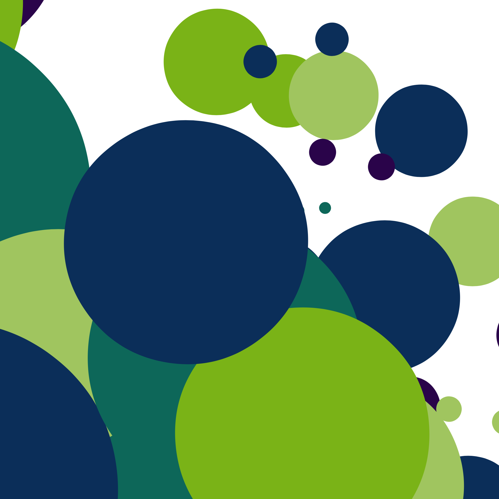
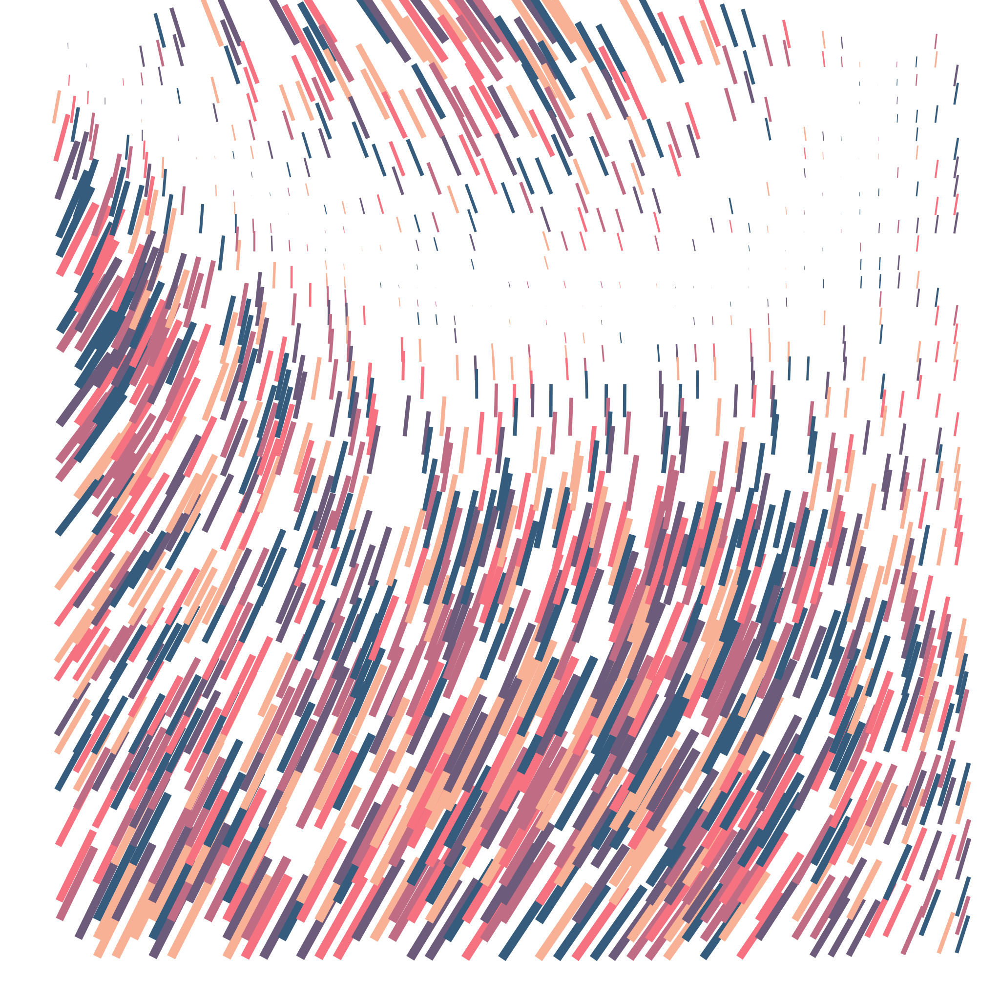
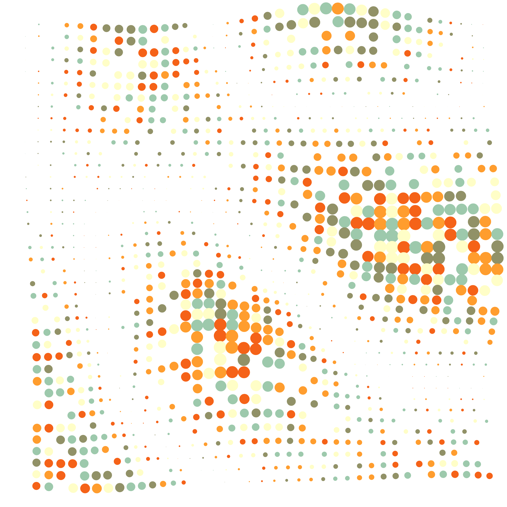
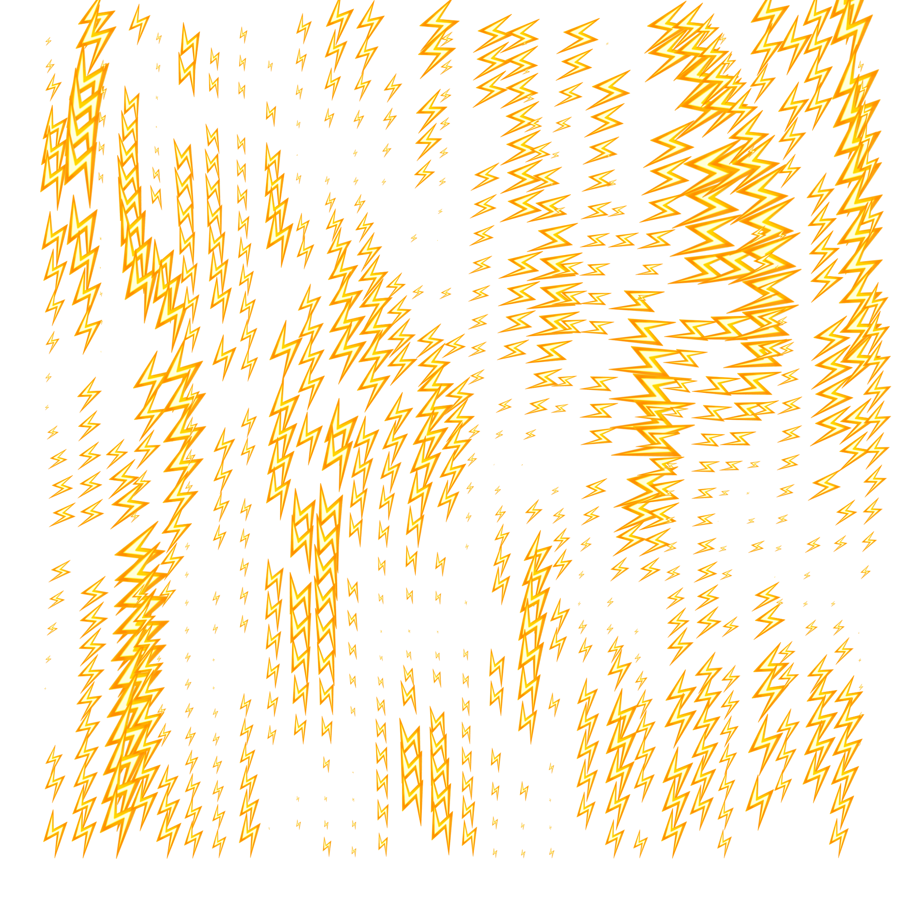
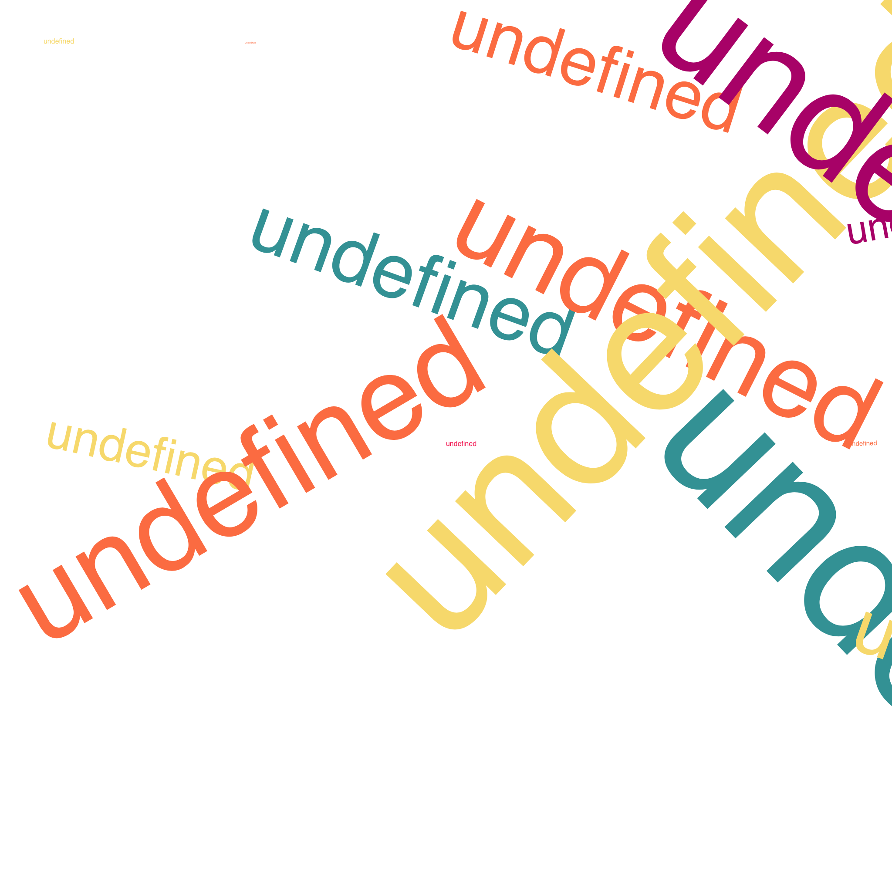

# Gen Art Canvas

A UI for playing around with parameters in a generative art example.

[Link to demo](https://andreidobrinski.com/gen-art-canvas/)

Original generative art sketch is done by Matt DesLauriers' Frontend Masters course, [Creative Coding with Canvas & WebGL](https://frontendmasters.com/courses/canvas-webgl/)

## Technologies Used

- [create-react-app](https://github.com/facebook/create-react-app)
- [canvas-sketch](https://github.com/mattdesl/canvas-sketch)
- [styled-components](https://github.com/styled-components/styled-components)
- [nice-color-palettes](https://github.com/Jam3/nice-color-palettes)
- [react-github-corner](https://github.com/skratchdot/react-github-corner)

## Running locally

1. Clone this repo
2. `cd` into the repo
3. `npm install`
4. `npm start`

## Examples

Examples with different symbols, parameters and emojis

and a bonus from the blooper reel

